<b>Warmonger</b> - companion app for wargaming

From login page the user can log in or register a new account.

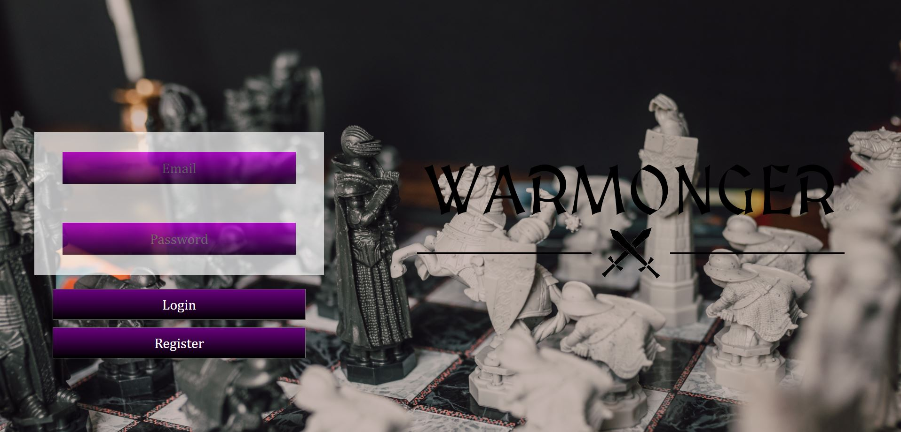

While registering the user needs to provide an email, password, name, surname, phone and a picture

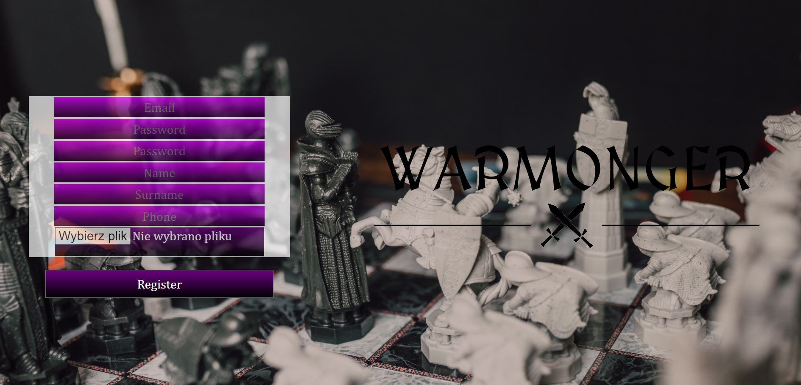

After logging in the user is redirected to the rosters page, where all the rosters ale listed. The user can search for specific rosters or add a new one

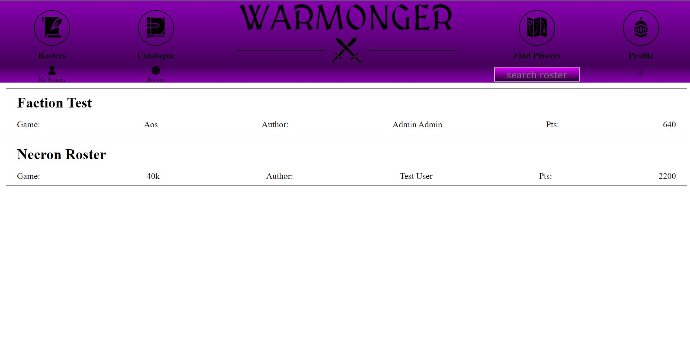

On the adding page the user must provide a title for the roster, the game system and faction. The roster is then created with user's id as the author

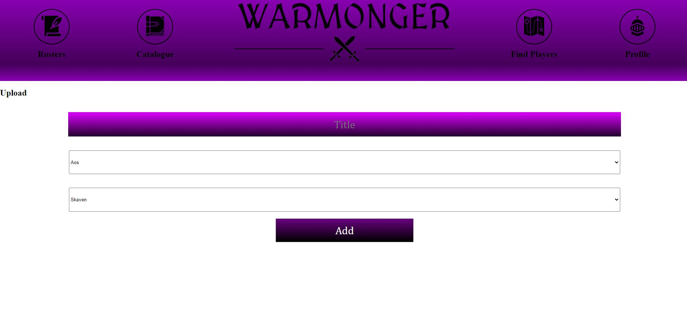

While checking individual rosters the user can see the units added to that roster with brief description and add new onest to their roster. User cannot add units to the roster owned by other user

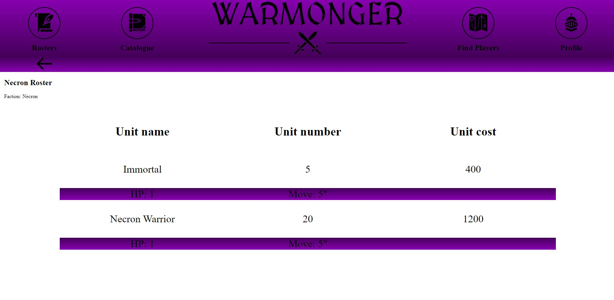

On the catalogue section the user can navigate the various game systems and factions to see individual units with pictures and more description

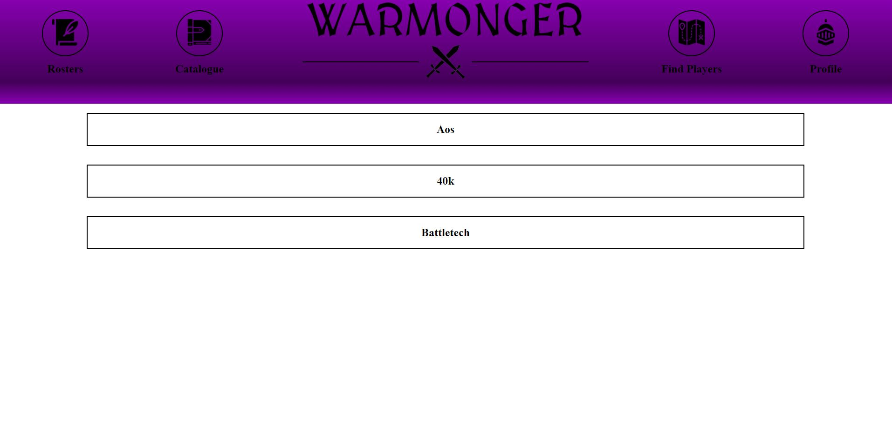

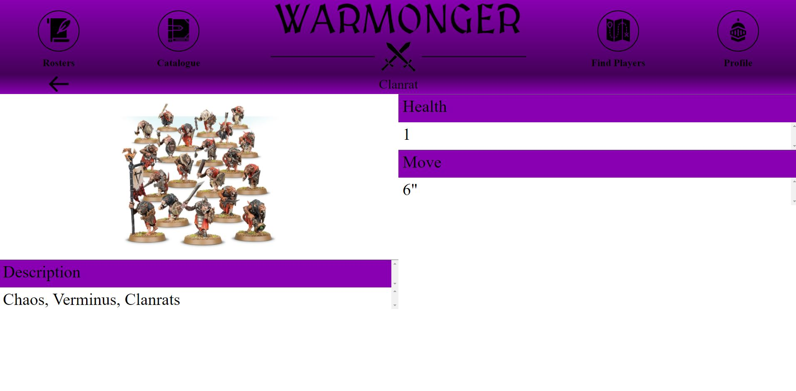

On the profile page the user can see their information. Here the user can also see their favourite games or add a new one from the available games

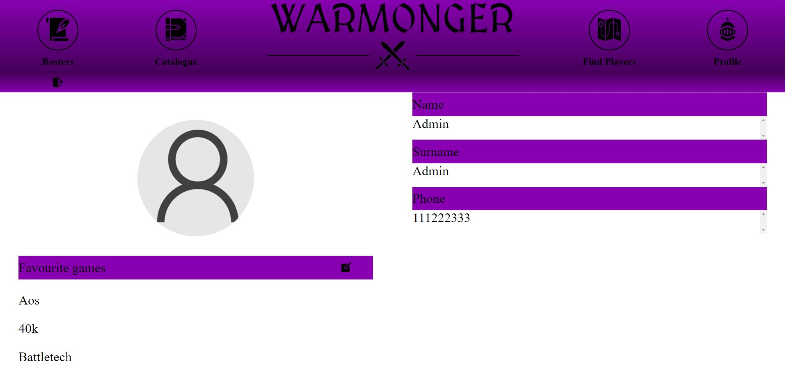

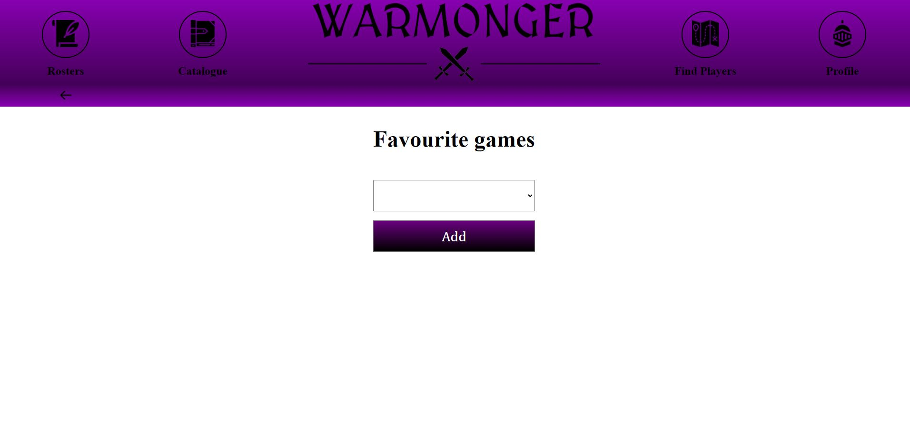

The page works in mobile

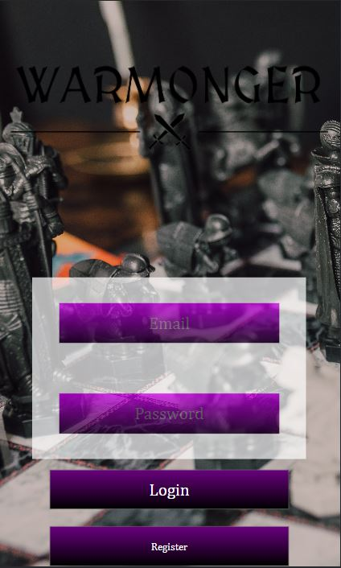
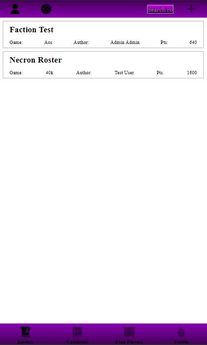
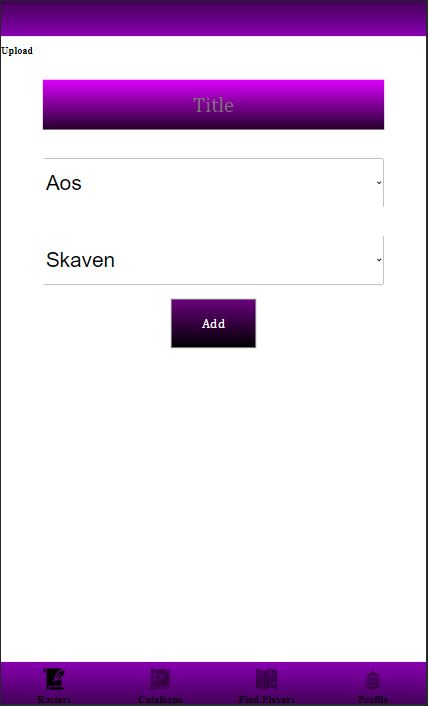
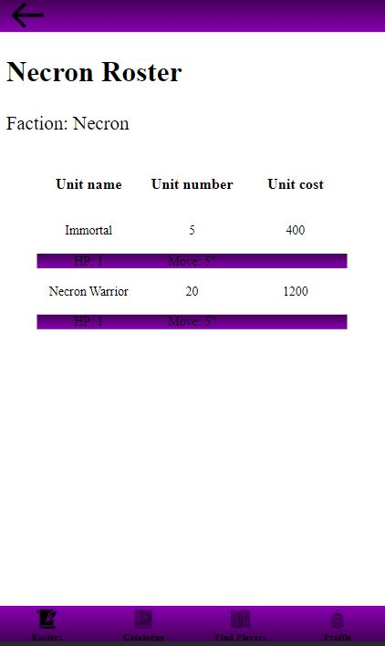
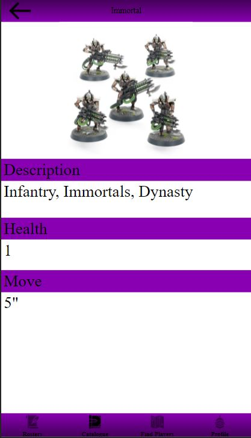
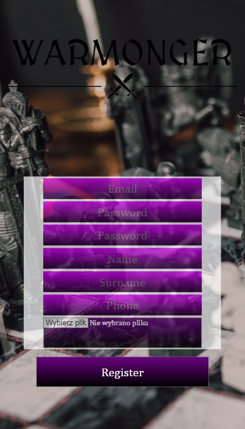

Diagram erd

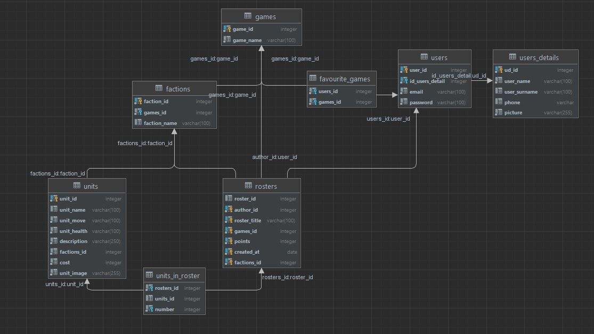
